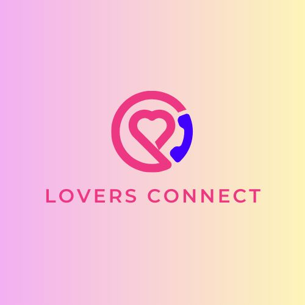
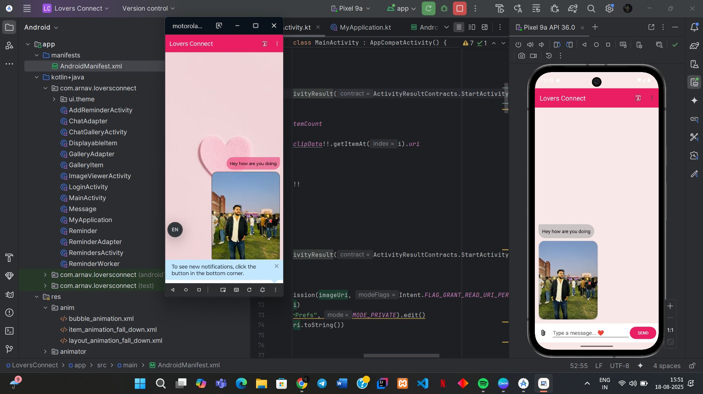
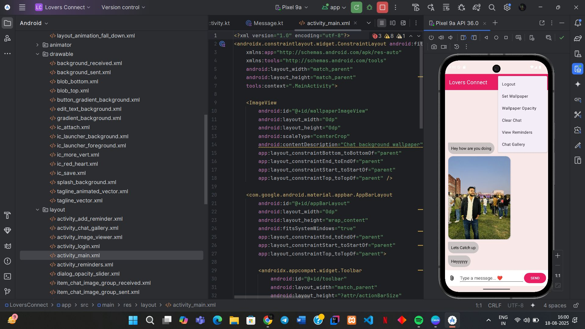
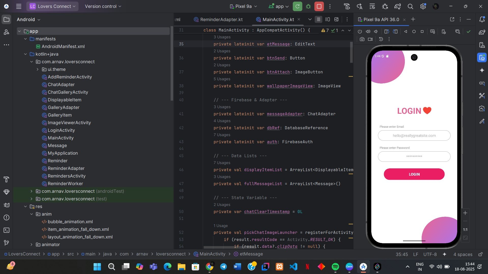

# Lovers Connect 💖

A beautifully designed, feature-rich Android application tailored for couples to securely connect, track special dates, and never miss an important anniversary. Built with Kotlin and Firebase.

## ✨ Features

* **🔒 Secure Authentication:** * Standard Email/Password login powered by Firebase Auth.
    * Integrated **Biometric Lock** (Fingerprint/Face Unlock) for quick and secure app access.
* **📅 Interactive Calendar:** * Customized Material Calendar View to select dates.
    * Visual indicators (like hearts) for special upcoming events.
* **🔔 Smart Reminders System:**
    * Create, Edit, and Delete custom reminders (e.g., "2.5 Year Anniversary").
    * Scheduled local push notifications using `WorkManager`, ensuring reliable alerts even if the app is closed.
    * Fully compatible with Android 13+ Notification Permissions.
* **🎨 Modern, Vibrant UI/UX:**
    * Custom-built, aesthetically pleasing login screen featuring vector gradient blobs.
    * "Bubble" style reminder cards with vibrant colors.
    * Satisfying interactive animations (like scale "pop" animations on click).
    * Consistent Material Design Action Bars across all screens.

## 🛠️ Tech Stack

* **Language:** Kotlin
* **UI Toolkit:** Android Views (XML), Material Design Components
* **Backend:** Firebase (Authentication & Realtime Database)
* **Background Tasks:** AndroidX WorkManager
* **Security:** AndroidX Biometric
* **Third-Party Libraries:** [Applandeo Material Calendar View](https://github.com/Applandeo/Material-Calendar-View)

## 📸 Screenshots

| |  |  |  |

## 🚀 Getting Started

Follow these instructions to get a copy of the project up and running on your local machine for development and testing.

### Prerequisites

* Android Studio (Latest Version)
* A Firebase Account (Free tier is perfectly fine)

### Installation & Setup

1.  **Clone the repository:**
2.  **Open the project:** Open Android Studio, select "Open an existing project," and navigate to the cloned folder.
3.  **Set up Firebase:**
    * Go to the [Firebase Console](https://console.firebase.google.com/) and create a new project.
    * Register a new Android App in the console using the package name `com.arnav.loversconnect`.
    * Download the `google-services.json` file.
    * Place the `google-services.json` file into the `app/` directory of this Android Studio project.
    * In the Firebase Console, enable **Email/Password Authentication**.
    * In the Firebase Console, enable the **Realtime Database** and set the security rules to allow authenticated users to read/write.
4.  **Build and Run:**
    * Sync the Gradle files.
    * Run the app on a physical device or an Android Emulator (API 24 or higher recommended).

## 🔮 Future Roadmap

This project is actively being developed. Upcoming features include:
* [ ] In-app Chat messaging.
* [ ] Media sharing (sending images and videos).
* [ ] Shared memories gallery.
* [ ] Instant "Thinking of You" notifications.

## 🤝 Contributing
Contributions, issues, and feature requests are welcome!

